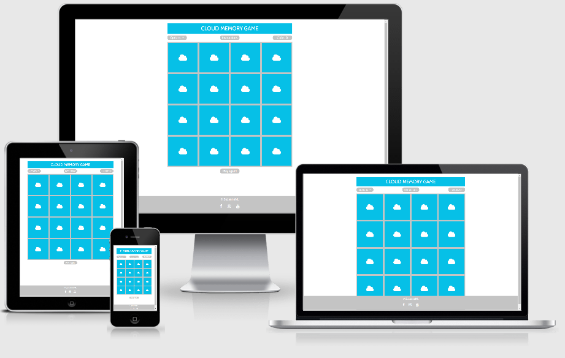

# CLOUD MEMORY GAME
## Milestone project no.2
### Interactive Frontend Development Milestone Project
#### Click [here](https://suzannenl.github.io/clouds-memory-game/) for a link to the live website.
This website was created for educational purposes only.

## INTRODUCTION
As a memory game, this game can be played by people who want to test their memory, but it is specifically aimed at cloud enthusiasts. A user can test his memory by matching two identical images of clouds. Or he can test his knowledge of cloud names by matching a cloud image to a card with its corresponding cloud name.
This was website was built using HTML, CSS and Javascript (VanillaJS, no jQuery). It can be viewed on pc monitors, laptops, tablets and mobile devices. It is hosted on GitHub Pages and can be viewed [here](https://suzannenl.github.io/clouds-memory-game/).

## Table of contents
- [**UX**](#UX)
    - [Goal/Strategy](#Goal/Strategy)
    - [Scope](#Scope)
    - [Structure](#Structure)
    - [Skeleton](#Skeleton)
    - [Target audiences](#Target-audiences)
    - [User Stories](#User-Stories)
    - [Design](#Design)
    - [Mock-ups](#Mock-ups)
- [**Features**](#Features)
    - [Existing features](#Existing-features)
    - [Features left to implement](#Features-left-to-implement)
- [**Technologies used**](#Technologies-used)
- [**Testing**](https://github.com/mkthewlis/Milestone-Project-3/blob/master/testing.md)
- [**Deployment**](#Deployment)
- [**Credits**](#Credits)
    - [Content](#Content)
    - [Media](#Media)
    - [Tutorials](#Tutorials)
    - [Acknowledgements](#Acknowledgements)

## UX
### Goal/Strategy
The goal of this website is to entertain users (mainly cloud enthusiasts) with a fun memory card game and to allow them to test their knowledge of cloud names. 

### Scope
An easy to navigate and responsive website that is entertaining and allows a user to test his memory and knowledge of clouds. 

### Structure
The website consists of a single page. It presents a memory card game. Between the header and the game, there are three items:
- Options, allowing a user to choose whether he wants to play with card images only or with cloud images and cloud names. The default setting is option 1 (cloud images).
- Instructions, a button which when clicked on, presents a modal with instructions on how to play the game.
- Clicks, which shows the number of clicks used in the game.
Below the game is the button 'play again!', which resets the game and shuffles the cards. 
At the bottom is the footer with icons that direct to different (social) media websites.

### Skeleton
Wireframes were created using Figma. Images of these wireframes are available under 'wireframes'. Responsiveness concerns mostly of adapting the size of the game and items to different sizes of screens. The design is consistent. 

### Target audiences
The game targets cloud enthusiasts, especially option 2 where knowledge of cloud names can be tested. However, anyone who wants to test their memory can play option 1. 

### User stories
As the creator of this website...
- I want my website and game to be simple but attractive so that a user is enticed to play the game.
- I want my website to have a clear and simple structure, so that it is easy to navigate.
- I want my website to entertain the user with a fun memory game, that he will want to play several times - for example to try again to improve the number of clicks needed.
- I want my website to 'reward' a user with sound effects and a modal at the end of the game. 

As a user....
- I enjoy looking at pretty pictures of clouds.
- I want to entertain myself by playing a game.
- I want to test my memory and/or knowledge of cloud names.
- I want to know if the matches I make between cloud images (or images and cloud names) are correct.
- I want to be rewarded for my actions or receive feedback while playing this game. This is the purpose of the sound effects, click counter and modals.
- I want a game that can't break.
- I want to be able to improve myself by keeping track of the number of clicks needed to finish the game.
- I want to be able to contact the creator of the game through social media. 

### Design
Game websites can be very colorful, busy and loud, to make them playful. I however decided to go for a simple design, with only a few colors and no background image or music. Every element has a function, and there are hardly any distractions. I believe that the use of this simple lay-out and structure, and these few colors, make the images of the clouds stand out more. They are the center of this game. Also, looking at clouds is a relaxing activity. I didn't want my game to hype people up. Therefore, I did not make this website too busy. 
I was inspired by the website of the Cloud Appreciation Society, and used similar colors of blue and grey. They are the main colors. In total, 6 colors are used:
-  #06C0E7 cerulean  
-  #04829C deep cerulean
-  #C4C4C4 silver
-  #F1F1F1 seashell
-  #FAFAFA alabaster
-  #FFFFFF white

I used the following font-families:
- 'Cabin' for the header and buttons.
- 'Raleway' for the name cards. 

### Mock-ups
Mock-ups for this website were created using Figma.
- Desktop version:

- Mobile devices version:

## FEATURES
### Existing features
- This website presents a game that is ready to be played.
- This website offers a user instructions on how to play the game.
- This game offers the opportunity to test one's knowledge of cloud names by selecting the second option.
- The game offers the possibility to reset the game at any given time.
- Users can switch to a different option, even mid-game. The game is reset and the cards are shuffled.
- The website keeps track of the number of clicks needed to finish the game.
- The game entertains and rewards a user with visual effects and sound effects.
- The website rewards a user with a modal after completing the game.
- Users can be directed to (social) media websites, through the footer.
- This website consists of a header, buttons, a click-counter, a game and a footer.
- This website contains images and icons. 
- This website was built using HTML, CSS (Flexbox and Bootstrap) and Javascript (VanillaJS), and has a responsive design. 
- This website was built in GidPod and hosted by GitHub pages. 
- Documentation.

### Features left to implement
- The game could be expanded by adding more clouds and different levels with clouds that are easier and harder to identify/name. There are in fact 89 variations of clouds! 
- Background music or sounds (like the sound of the wind) could be added. I chose not to, because I didn't want to distract the users from the game. However, I could add an on/off button so that a user can decide for himself if he wants to listen to the sound of the wind whilst playing the game. 
- Memory games of other students include a timer. A timer could be added, but I chose not to because I want this game to be relaxing (because looking at clouds is relaxing). I do however see how this could be a feature that would make a player more competitive. 
- Dark mode. Someone pointed out that there's a lot of white on my page, which could be uncomfortable for users who want to play the game for a long time (for example, when there are a lot more different levels). I would choose a darker back-ground and darker colors and memory cards. The images would remain the same, though. 

## TECHNOLOGIES USED
- [HTML](https://developer.mozilla.org/en-US/docs/Web/HTML)
was used for the structure of the website.

- [CSS](https://developer.mozilla.org/en-US/docs/Web/CSS)
was used to add style to the website.

- [Javascript](https://developer.mozilla.org/en-US/docs/Web/Javascript)
was used as an application controller.

- [Bootstrap 4](https://getbootstrap.com/)
was used for making the website responsive and fit for mobile use.

- [Google Chrome](https://www.google.com/chrome/)
was used for the Chrome DevTools and as a browser.

- [Google Fonts](https://fonts.google.com/)
was used to select font-families Raleway and Cabin. 

- [Git](https://git-scm.com/)
was used for Version Control.

- [GitHub](https://github.com/)
is where the repository is hosted.

- [GitHub Pages](https://suzannenl.github.io/clouds-memory-game/)
is where the live website is hosted.

- [Font awesome](https://fontawesome.com/)
was used for the different icons.

- [Figma](https://www.figma.com/)
was used to create wireframes. 

- [Am I Responsive](http://ami.responsivedesign.is/)
was used to test the responsiveness of the website.

- [Autoprefixer CSS online](https://autoprefixer.github.io/)
was used to prefix my CSS.

## TESTING
The testing process can be found in this separate document [here](
https://github.com/SuzanneNL/clouds-memory-game/blob/master/testing.md).

## DEPLOYMENT
The website was coded in GitPod and then published using GitHub pages. 
To deploy this project, the following steps were taken:
1. Go to github.com and click on the repository [SuzanneNL/clouds-memory-game](https://github.com/SuzanneNL/clouds-memory-game).
2. At the top right of the page, click on 'settings'.
3. Scroll down to 'GitHub pages'.
4. Under 'source', click on the dropdown menu and select 'Master Branch'.
5. Save. 

Local Deployment:
To run this website on your personal device, you can follow these steps: 
1. Go to the repository [SuzanneNL/clouds-memory-game](https://github.com/SuzanneNL/clouds-memory-game).
2. Click on 'clone or download'.
3. Click on 'download zip'.
4. Unzip the downloaded zip file.
5. Run the file 'index.html'.
6. The website will open in the default browser of your device.

## CREDITS
### Content
The text for all the sections of the website were written by me.

### Media
All the images used in this game were obtained from the Instagram account [@whatsthiscloud](https://www.instagram.com/whatsthiscloud/)
- Cirrocumulus - original photo by user @cloud_bashing_pilot
- Cumulonimbus - original photo by user @mizeyes
- Fallstreak hole - original photo by user @eagle.ed
- Horseshoe vortex - original photo by @whatsthiscloud
- Lacunosus - original photo by user @itspoultrynmotion
- Lenticularis - original photo by user @pilot_lindy
- Mammatus - original photo by user @fotometeokevins
- Noctilucent - original photo by user @fluffles2016

Sounds:
- [Flip sound](https://freesound.org/people/qubodup/sounds/60013/)
- [Match sound](https://freesound.org/people/grunz/sounds/109662/)
- [Win sound](https://freesound.org/people/nolhananas/sounds/476340/)
- [Shuffle sound](https://freesound.org/people/deathpie/sounds/19245/)

### Tutorials and sources 
- Tutorials:
    - https://www.youtube.com/watch?v=ZniVgo8U7ek
    - https://www.youtube.com/watch?v=KX0NR5HtQ1Q
- Testing file:
    - https://github.com/AJGreaves/picflip/blob/master/testing.md

### Acknowledgements
I was inspired by the website of the [Cloud Appreciation Society](https://cloudappreciationsociety.org/).

I received advice and encouragement from:
- Thomas
- Friends and family
- Seun Owonikoko
- Mark Gulliver
- Code Institute
